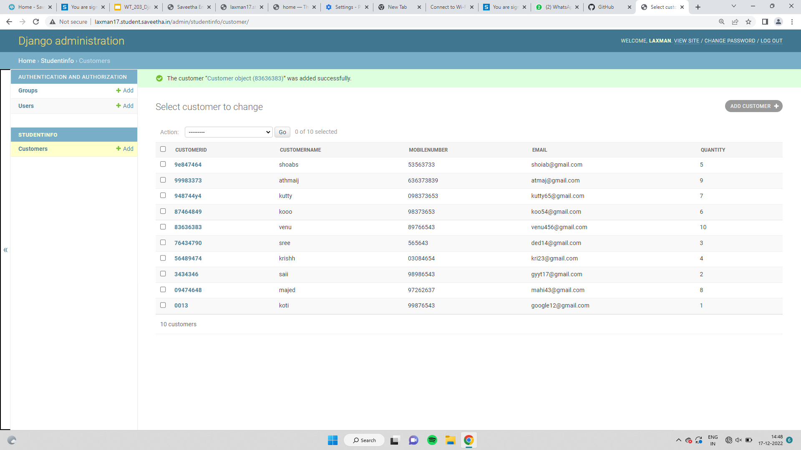

## DESIGN STEPS

### STEP 1:
creating and collecting using django

### STEP 2:
implementation using python code

### STEP 3:
pushing to github


## PROGRAM
```
from django.db import models

# Create your models here. 
from django.db import models
from django.contrib import admin
# Create your models here.
class Customer(models.Model):
    customerid = models.CharField(max_length=8,primary_key=True)
    customername =models.CharField(max_length=100)
    mobilenumber =models.CharField(max_length=100)
    email = models.EmailField()
    quantity= models.IntegerField()
    

class CustomerAdmin(admin.ModelAdmin):
    list_display = ('customerid','customername','mobilenumber','email','quantity')
```

Include your code here

## OUTPUT



Include the screenshot of your admin page.


## RESULT
thus the experiment was executed successfully
